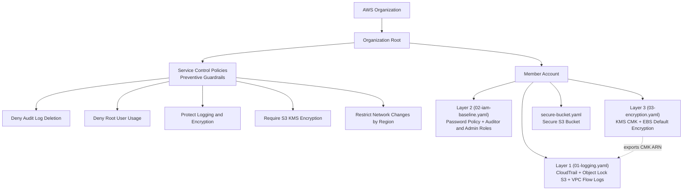

# AWS Compliance as Code

This project implements compliance controls as code using AWS Service Control Policies (SCPs) and CloudFormation. Rather than relying on manual compliance checks, I built automated, enforceable guardrails that prevent non-compliant actions at the AWS Organization level and deploy secure infrastructure by default.

The controls in this repository map to requirements from CJIS Security Policy, FedRAMP, and NIST 800-53, demonstrating how compliance frameworks translate into real, enforceable cloud infrastructure policies.

## Architecture Overview



SCPs are attached at the Organization Root, enforcing preventive guardrails across all accounts. These policies override IAM permissions, including administrator access, so non-compliant actions are blocked before they happen. CloudFormation templates are deployed into member accounts as numbered layers (`01` → `02` → `03`), each building on the previous, to provision resources that meet security baselines without manual configuration. Together, they create a defense-in-depth model where organization-level policies and account-level infrastructure work in tandem.

## Compliance Frameworks

### CJIS Security Policy

The FBI's [CJIS Security Policy](https://le.fbi.gov/file-repository/cjis_security_policy_v6-0_20241227.pdf) establishes security requirements for any organization that accesses, stores, or transmits Criminal Justice Information (CJI). This includes law enforcement agencies, cloud service providers hosting CJI, and contractors supporting criminal justice systems. Version 6.0 (released December 2024) restructured the policy from 13 to 20 policy areas, now organized by NIST 800-53 control families: Access Control (AC), Auditing and Accountability (AU), Configuration Management (CM), Systems and Communications Protection (SC), and others. Controls use NIST 800-53 identifiers directly, aligning CJIS requirements with federal cybersecurity standards. Version 6.0 introduces priority levels (P1 through P4) for phased implementation, with FBI audits underway as of October 2025 and full compliance expected by October 2027.

### FedRAMP

The [Federal Risk and Authorization Management Program (FedRAMP)](https://www.fedramp.gov/) standardizes security assessments for cloud service providers (CSPs) serving federal agencies. FedRAMP defines three authorization baselines, Low, Moderate, and High, corresponding to the FIPS 199 impact level of the data being processed. Each baseline specifies a set of required NIST 800-53 controls. This project targets FedRAMP High, which requires the most comprehensive set of security controls and applies to systems processing the government's most sensitive unclassified data.

### NIST SP 800-53 Rev. 5

[NIST Special Publication 800-53 Revision 5](https://csf.tools/reference/sp-800-53/r5/) is the authoritative catalog of security and privacy controls for federal information systems. It serves as the foundation for both CJIS and FedRAMP requirements. Controls are organized into families (AC for Access Control, AU for Audit, SC for System and Communications Protection, CM for Configuration Management) and provide the technical specificity needed to translate compliance requirements into enforceable infrastructure policies.

## Controls Implemented

| Control / Component | File | Type | What It Enforces | Security Principle |
|---|---|---|---|---|
| Deny Audit Log Deletion | `scps/scp-deny-audit-log-deletion.json` | SCP (Preventive) | Denies `cloudtrail:DeleteTrail` and `cloudtrail:StopLogging` org-wide | Audit Integrity |
| Deny Root User Usage | `scps/scp-deny-root-usage.json` | SCP (Preventive) | Denies all actions by the account root user, except MFA enrollment, account summary, and AWS Support | Least Privilege |
| Protect Logging and Encryption | `scps/scp-protect-logging-and-encryption.json` | SCP (Preventive) | Denies `ec2:DeleteFlowLogs` and `ec2:DisableEbsEncryptionByDefault`, guarding the Layer 1 and Layer 3 controls | Audit Integrity / Data Protection |
| Require S3 KMS Encryption | `scps/scp-require-s3-encryption.json` | SCP (Preventive) | Denies `s3:PutObject` unless the request specifies `aws:kms` server-side encryption | Data Protection at Rest |
| Restrict Network Changes by Region | `scps/scp-restrict-network-changes-by-region.json` | SCP (Preventive) | Denies security group ingress/egress changes outside approved regions (`us-east-1`, `us-west-2`) | Network Boundary Protection |
| Layer 1 — Logging and Monitoring | `cloudformation/01-logging.yaml` | CloudFormation (IaC) | Multi-region CloudTrail, an Object Lock (COMPLIANCE mode) log bucket, a CloudWatch log group, and VPC Flow Logs | Audit and Accountability |
| Layer 2 — IAM Baseline | `cloudformation/02-iam-baseline.yaml` | CloudFormation (IaC) | Account password policy, a read-only auditor role, and an MFA + ExternalId admin role capped by a permissions boundary | Identity and Least Privilege |
| Layer 3 — Encryption | `cloudformation/03-encryption.yaml` | CloudFormation (IaC) | Customer-managed KMS CMK with annual rotation, a separated key policy, and account-level EBS encryption-by-default | Data Protection at Rest |
| Secure S3 Bucket | `cloudformation/secure-bucket.yaml` | CloudFormation (IaC) | An S3 bucket with all public access blocked and AES256 server-side encryption | Secure by Default |

## Compliance Framework Mapping

Each control was selected to address specific compliance requirements across CJIS Security Policy, FedRAMP, and NIST 800-53. The combination of preventive SCPs and compliant-by-default IaC templates creates layered enforcement; SCPs act as guardrails that cannot be bypassed even by IAM administrators, while CloudFormation ensures new resources are provisioned to meet baseline security requirements without manual configuration.

| Control / Component | CJIS Security Policy (v6.0) | FedRAMP Baseline | NIST 800-53 Rev. 5 |
|---|---|---|---|
| Deny Audit Log Deletion | AU-9 (Protection of Audit Information), AU-12 (Audit Record Generation) | AU-9 (L/M/H), AU-12 (L/M/H) | AU-9 (Protection of Audit Information), AU-12 (Audit Record Generation) |
| Deny Root User Usage | AC-6 (Least Privilege), AC-3 (Access Enforcement) | AC-6 (M/H), AC-3 (L/M/H) | AC-6 (Least Privilege), AC-3 (Access Enforcement) |
| Protect Logging and Encryption | AU-9 (Protection of Audit Information), SC-28 (Protection of Information at Rest) | AU-9 (L/M/H), SC-28 (M/H) | AU-9 (Protection of Audit Information), SC-28 (Protection of Information at Rest) |
| Require S3 KMS Encryption | SC-28 (Protection of Information at Rest), SC-13 (Cryptographic Protection) | SC-28 (M/H), SC-13 (L/M/H) | SC-28 (Protection of Information at Rest), SC-13 (Cryptographic Protection) |
| Restrict Network Changes by Region | SC-7 (Boundary Protection) | SC-7 (L/M/H) | SC-7 (Boundary Protection) |
| Layer 1 — Logging and Monitoring | AU-2 (Event Logging), AU-3 (Content of Audit Records), AU-9, AU-12 | AU-2 (L/M/H), AU-3 (L/M/H), AU-9 (L/M/H), AU-12 (L/M/H) | AU-2 (Event Logging), AU-3 (Content of Audit Records), AU-9 (Protection of Audit Information), AU-12 (Audit Record Generation) |
| Layer 2 — IAM Baseline | AC-2 (Account Management), AC-3 (Access Enforcement), AC-6 (Least Privilege), IA-5 (Authenticator Management) | AC-2 (L/M/H), AC-3 (L/M/H), AC-6 (M/H), IA-5 (L/M/H) | AC-2 (Account Management), AC-3 (Access Enforcement), AC-6 (Least Privilege), IA-5 (Authenticator Management) |
| Layer 3 — Encryption | SC-12 (Cryptographic Key Management), SC-13 (Cryptographic Protection), SC-28, SC-28(1) | SC-12 (L/M/H), SC-13 (L/M/H), SC-28 (M/H), SC-28(1) (M/H) | SC-12 (Cryptographic Key Establishment and Management), SC-13 (Cryptographic Protection), SC-28 (Protection of Information at Rest), SC-28(1) (Cryptographic Protection) |
| Secure S3 Bucket | SC-28 (Protection of Information at Rest), AC-3 (Access Enforcement) | SC-28 (M/H), AC-3 (L/M/H) | SC-28 (Protection of Information at Rest), AC-3 (Access Enforcement) |

> **Note:** CJIS v6.0 now uses NIST 800-53 control identifiers directly, so the CJIS and NIST columns share the same control IDs. The distinction is that CJIS scopes these requirements specifically to Criminal Justice Information (CJI), while NIST 800-53 applies broadly to federal information systems.

> **FedRAMP Baseline Key:** L = Low, M = Moderate, H = High

## Repository Structure

```
aws-compliance-as-code/
├── cloudformation/
│   ├── 01-logging.yaml                 # Layer 1: CloudTrail + Object Lock S3 + CloudWatch + VPC Flow Logs
│   ├── 02-iam-baseline.yaml            # Layer 2: IAM password policy + auditor/admin roles
│   ├── 03-encryption.yaml              # Layer 3: KMS CMK + alias + EBS encryption-by-default
│   └── secure-bucket.yaml              # Standalone: secure S3 bucket (public access block + AES256)
├── scps/
│   ├── scp-deny-audit-log-deletion.json            # SCP: Deny CloudTrail DeleteTrail / StopLogging
│   ├── scp-deny-root-usage.json                    # SCP: Deny root user actions (except MFA setup / support)
│   ├── scp-protect-logging-and-encryption.json     # SCP: Deny DeleteFlowLogs / DisableEbsEncryptionByDefault
│   ├── scp-require-s3-encryption.json              # SCP: Deny S3 PutObject without SSE-KMS
│   └── scp-restrict-network-changes-by-region.json # SCP: Deny security group changes outside approved regions
├── LICENSE.txt                         # MIT License
└── README.md
```

The numbered CloudFormation prefixes (`01`–`03`) indicate deployment order; each layer builds on the one before it.

## AWS Services Used

- **[AWS Organizations](https://aws.amazon.com/organizations/)**: Hosts the SCPs and enforces preventive guardrails across the account hierarchy
- **[AWS CloudFormation](https://aws.amazon.com/cloudformation/)**: Deploys the layered compliance infrastructure as code
- **[AWS CloudTrail](https://aws.amazon.com/cloudtrail/)**: Multi-region API audit logging (Layer 1)
- **[AWS KMS](https://aws.amazon.com/kms/)**: Customer-managed key for encryption at rest (Layer 3)
- **[AWS IAM](https://aws.amazon.com/iam/)**: Password policy, scoped roles, and permissions boundary (Layer 2)
- **[Amazon S3](https://aws.amazon.com/s3/)**: Object Lock log storage and the secure bucket baseline
- **[Amazon EBS](https://aws.amazon.com/ebs/)**: Account-level encryption-by-default for new volumes (Layer 3)
- **[Amazon CloudWatch Logs](https://aws.amazon.com/cloudwatch/)**: Hot, queryable copy of CloudTrail and VPC Flow Log events
- **[AWS Lambda](https://aws.amazon.com/lambda/)**: Backs the custom resources for account settings with no native CloudFormation type
- **[AWS CLI](https://aws.amazon.com/cli/)**: Interface for deploying SCPs and CloudFormation stacks

## How It Works

### Service Control Policies (Preventive Guardrails)

SCPs are attached at the Organization Root and act as permission boundaries that override IAM, even for administrator users. They are preventive controls: non-compliant actions are denied before they execute, regardless of the IAM policies attached to the requesting principal. This makes them ideal for enforcing compliance boundaries that individual account configurations cannot circumvent.

### CloudFormation (Compliant by Default)

CloudFormation templates encode security requirements directly into resource definitions, so resources deploy in their intended secure state every time, eliminating configuration drift and manual misconfiguration. The templates are organized as numbered layers (`01-logging.yaml` → `02-iam-baseline.yaml` → `03-encryption.yaml`) that build on one another — Layer 3's KMS key, for example, is exported and adopted by Layer 1's CloudTrail log bucket. Each template is auditable documentation of the intended secure state.

### Defense in Depth

SCPs prevent non-compliant actions at the organization level. CloudFormation ensures compliant defaults at the resource level. Git version control tracks every policy and template change, creating an auditable history that serves as evidence for compliance audits. This layered approach means a failure in one control does not compromise the overall security posture.

## Deployment

<details>
<summary>Click to expand deployment instructions</summary>

### Prerequisites

- AWS account with Organizations enabled
- IAM user with appropriate permissions
- AWS CLI v2 installed and configured

### Step 1: Discover Organization IDs

**Get Organization Root ID:**

```
aws organizations list-roots \
    --query "Roots[0].Id" \
    --output text
```

Example output:

```
r-abcd
```

**List Organizational Units (if applicable):**

```
aws organizations list-organizational-units-for-parent \
    --parent-id <ROOT_ID> \
    --query "OrganizationalUnits[*].Id" \
    --output text
```

Example output:

```
ou-abcd-12345678 ou-abcd-87654321 ou-abcd-a1b2c3d4
```

### Step 2: Deploy Service Control Policies

**Create each SCP:**

```
aws organizations create-policy \
    --content file://<SCP_FILENAME>.json \
    --name <SCP_NAME> \
    --description "<POLICY_DESCRIPTION>" \
    --type SERVICE_CONTROL_POLICY
```

Replace `<SCP_FILENAME>` and `<SCP_NAME>` with the appropriate values for each policy.

Example output:

```
{
    "Policy": {
        "PolicySummary": {
            "Id": "p-0abc1234",
            "Arn": "arn:aws:organizations::123456789012:policy/service_control_policy/p-0abc1234",
            "Name": "SCP-DenyAuditLogDeletion",
            "Description": "Prevents the deletion of audit logs.",
            "Type": "SERVICE_CONTROL_POLICY",
            "AwsManaged": false
        },
        "Content": "..."
    }
}
```

**List deployed SCPs:**

```
aws organizations list-policies \
    --filter SERVICE_CONTROL_POLICY \
    --query "Policies[].{Name:Name, Id:Id}" \
    --output table
```

Example output:

```
----------------------------------------------
|              ListPolicies                  |
----------------------------------------------
|     Name                     |     Id       |
|------------------------------|--------------|
|  SCP-DenyRootUserActions     |  p-1a2b3c4d  |
|  SCP-DenyAuditLogDeletion    |  p-5e6f7g8h  |
|  SCP-RestrictNetworkChanges  |  p-9j0k1l2m  |
----------------------------------------------
```

**Attach each SCP to the Organization Root:**

```
aws organizations attach-policy \
    --policy-id <POLICY_ID> \
    --target-id <ROOT_ID>
```

**Verify SCPs are attached:**

```
aws organizations list-policies-for-target \
    --target-id <ROOT_ID> \
    --filter SERVICE_CONTROL_POLICY \
    --output table
```

Example output:

```
------------------------------------------------------
|              ListPoliciesForTarget                 |
------------------------------------------------------
|     Name                     |        Id           |
|----------------------------------------------------|
|  SCP-DenyRootUserActions     |  p-1a2b3c4d         |
|  SCP-DenyAuditLogDeletion    |  p-5e6f7g8h         |
------------------------------------------------------
```

### Step 3: Deploy the CloudFormation Layers

Deploy the numbered templates in order — each layer builds on the previous. All three layers create IAM resources, so `CAPABILITY_NAMED_IAM` is required. (`secure-bucket.yaml` is a standalone foundational template and can be deployed independently.)

**Layer 1 — Logging & Monitoring.** Leave `LogsBucketCmkArn` unset for now; the CloudTrail log bucket uses SSE-S3 until the Layer 3 CMK exists.

```
aws cloudformation deploy \
    --stack-name compliance-layer1-logging \
    --template-file cloudformation/01-logging.yaml \
    --capabilities CAPABILITY_NAMED_IAM \
    --parameter-overrides DefaultVpcId=<DEFAULT_VPC_ID>
```

**Layer 2 — IAM Baseline.** Supply a long random `AdminRoleExternalId`.

```
aws cloudformation deploy \
    --stack-name compliance-layer2-iam \
    --template-file cloudformation/02-iam-baseline.yaml \
    --capabilities CAPABILITY_NAMED_IAM \
    --parameter-overrides AdminRoleExternalId=<LONG_RANDOM_STRING>
```

**Layer 3 — Encryption.** Pass the Layer 2 admin role as key administrator and the Layer 2 auditor role as key user (so it can decrypt CloudTrail logs for evidence collection).

```
aws cloudformation deploy \
    --stack-name compliance-layer3-encryption \
    --template-file cloudformation/03-encryption.yaml \
    --capabilities CAPABILITY_NAMED_IAM \
    --parameter-overrides \
        KeyAdministratorRoleArn=$(aws cloudformation describe-stacks --stack-name compliance-layer2-iam \
            --query "Stacks[0].Outputs[?OutputKey=='AdminRoleArn'].OutputValue" --output text) \
        KeyUserRoleArns=$(aws cloudformation describe-stacks --stack-name compliance-layer2-iam \
            --query "Stacks[0].Outputs[?OutputKey=='AuditorRoleArn'].OutputValue" --output text)
```

**Second pass — wire the CMK into Layer 1.** Re-deploy Layer 1 with the Layer 3 CMK ARN to switch the CloudTrail log bucket to SSE-KMS (agency-managed key). This two-pass step breaks the cycle: Layer 1 is numbered first but its encryption key is created in Layer 3.

```
aws cloudformation deploy \
    --stack-name compliance-layer1-logging \
    --template-file cloudformation/01-logging.yaml \
    --capabilities CAPABILITY_NAMED_IAM \
    --parameter-overrides DefaultVpcId=<DEFAULT_VPC_ID> \
        LogsBucketCmkArn=$(aws cloudformation describe-stacks \
        --stack-name compliance-layer3-encryption \
        --query "Stacks[0].Outputs[?OutputKey=='ComplianceCmkArn'].OutputValue" --output text)
```

**Verify deployment:**

```
aws cloudformation describe-stacks \
    --query "Stacks[*].StackName" \
    --output table
```

### Updating Policies and Templates

**Update an SCP:**

```
aws organizations update-policy \
    --policy-id <POLICY_ID> \
    --content file://<UPDATED_SCP>.json
```

**Update a CloudFormation stack:**

```
aws cloudformation deploy \
    --stack-name <STACK_NAME> \
    --template-file <STACK_FILENAME>.yaml \
    --capabilities CAPABILITY_NAMED_IAM
```

### Resource Cleanup

**Detach SCPs:**

```
aws organizations detach-policy \
  --policy-id <POLICY_ID> \
  --target-id <ORG_ROOT_ID>
```

**Delete CloudFormation stack:**

```
aws cloudformation delete-stack \
  --stack-name <STACK_NAME>
```

</details>

## Key Takeaways

- **Compliance as Code eliminates drift**: By encoding security requirements in CloudFormation, resources are provisioned correctly every time without relying on manual configuration.

- **SCPs enforce boundaries that IAM cannot**: Organization-level policies override even administrator permissions, providing a compliance layer that individual account configurations cannot circumvent.

- **Defense in depth through layered controls**: Preventive SCPs combined with compliant-by-default IaC creates multiple enforcement points, so a failure in one layer does not compromise the security posture.

- **Automation reduces human error**: Codified controls eliminate the inconsistency of manual reviews and create a repeatable, scalable compliance process.

- **Version control as audit evidence**: Every policy change is tracked in Git, providing a complete history that serves as compliance evidence during audits.

## What This Project Demonstrates

This project demonstrates the core GRC Engineering skill of translating compliance framework requirements into enforceable AWS controls. It showcases hands-on experience with AWS Organizations policy design, SCP authoring with condition-based logic, CloudFormation template development, and compliance framework mapping across CJIS Security Policy, FedRAMP, and NIST 800-53. The inclusion of CJIS and FedRAMP mappings reflects relevance to criminal justice environments and federal cloud authorization requirements.

The controls illustrate a range of enforcement patterns — action-scoped denials (CloudTrail log deletion), principal-scoped denials (root-user lockdown via `NotAction` plus an `aws:PrincipalArn` condition), region-conditioned rules (network changes confined to approved regions), and encryption mandates (S3 uploads required to use SSE-KMS) — alongside a layered, compliant-by-default CloudFormation baseline. Together they demonstrate the flexibility of SCPs and infrastructure-as-code as compliance enforcement mechanisms.

This foundation positions the project for expansion into CI/CD pipeline guardrails, AWS Config rules for continuous compliance monitoring, drift remediation automation, and multi-account architectures with OU-scoped policies.

## References

The following resources informed the design of this project:

- [FBI CJIS Security Policy v6.0](https://le.fbi.gov/file-repository/cjis_security_policy_v6-0_20241227.pdf)
- [FedRAMP Security Controls Baselines](https://www.fedramp.gov/baselines/)
- [GRC Engineering for AWS by AJ Yawn](https://ajyawn.com/books)
- [GRC Engineering for AWS Chapter 5 Repository](https://github.com/ajy0127/thegrcengineeringbook/tree/master/chapter-5)
- [NIST SP 800-53 Rev. 5: Security and Privacy Controls](https://csf.tools/reference/sp-800-53/r5/)
- [NIST SP 800-53B: Control Baselines for Information Systems](https://csrc.nist.gov/pubs/sp/800/53/b/upd1/final)
