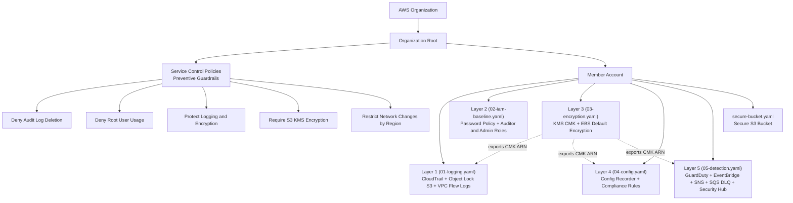

# AWS Compliance as Code

I implement compliance controls as code using AWS Service Control Policies (SCPs) and CloudFormation. Manual compliance checks do not scale. So I built automated guardrails that block non-compliant actions at the AWS Organization level and deploy secure infrastructure by default.

The controls map to CJIS Security Policy, FedRAMP, and NIST 800-53. The point is showing how those frameworks turn into enforceable cloud policies, not paperwork.

## Architecture Overview



Editable Mermaid source (kept in sync with the fence above): [`docs/architecture.mmd`](docs/architecture.mmd).

SCPs attach at the Organization Root and enforce preventive guardrails across all accounts. These policies override IAM permissions, including administrator access, so non-compliant actions are blocked before they happen. CloudFormation templates deploy into member accounts as numbered layers (`01` → `02` → `03` → `04` → `05`), each building on the previous, to provision resources that meet security baselines without manual configuration. Organization-level policies and account-level infrastructure work together.

## Compliance Frameworks

Three frameworks stack here. [NIST SP 800-53 Rev 5](https://csf.tools/reference/sp-800-53/r5/) is the control catalog. [FedRAMP](https://www.fedramp.gov/) High is the baseline for the government's most sensitive unclassified data, drawn from that catalog. The FBI's [CJIS Security Policy](https://le.fbi.gov/file-repository/cjis_security_policy_v6-1_20260625.pdf) scopes the same NIST control identifiers specifically to Criminal Justice Information, which is why the CJIS and NIST columns below share IDs. The CJIS v6.x timeline and the three deltas this baseline actually addresses are in [CJIS v6.1 Relevance](#cjis-v61-relevance).

## Controls Implemented

| Control / Component | File | Type | What It Enforces | Security Principle |
|---|---|---|---|---|
| Deny Audit Log Deletion | `scps/scp-deny-audit-log-deletion.json` | SCP (Preventive) | Denies `cloudtrail:DeleteTrail` and `cloudtrail:StopLogging` org-wide | Audit Integrity |
| Deny Root User Usage | `scps/scp-deny-root-usage.json` | SCP (Preventive) | Denies all actions by the account root user, except MFA enrollment, account summary, and AWS Support | Least Privilege |
| Protect Logging and Encryption | `scps/scp-protect-logging-and-encryption.json` | SCP (Preventive) | Denies `ec2:DeleteFlowLogs` and `ec2:DisableEbsEncryptionByDefault`, guarding the Layer 1 and Layer 3 controls | Audit Integrity / Data Protection |
| Require S3 KMS Encryption | `scps/scp-require-s3-encryption.json` | SCP (Preventive) | Denies `s3:PutObject` unless the request specifies `aws:kms` server-side encryption | Data Protection at Rest |
| Restrict Network Changes by Region | `scps/scp-restrict-network-changes-by-region.json` | SCP (Preventive) | Denies security group ingress/egress changes outside approved regions (`us-east-1`, `us-west-2`) | Network Boundary Protection |
| Layer 1: Logging and Monitoring | `cloudformation/01-logging.yaml` | CloudFormation (IaC) | Multi-region CloudTrail, an Object Lock (COMPLIANCE mode) log bucket, a CloudWatch log group, and VPC Flow Logs | Audit and Accountability |
| Layer 2: IAM Baseline | `cloudformation/02-iam-baseline.yaml` | CloudFormation (IaC) | Account password policy, a read-only auditor role, and an MFA + ExternalId admin role capped by a permissions boundary | Identity and Least Privilege |
| Layer 3: Encryption | `cloudformation/03-encryption.yaml` | CloudFormation (IaC) | Customer-managed KMS CMK with annual rotation, a separated key policy, and account-level EBS encryption-by-default | Data Protection at Rest |
| Layer 4: Configuration & Compliance | `cloudformation/04-config.yaml` | CloudFormation (IaC) | AWS Config recorder + delivery channel + dedicated SSE-KMS Object-Lock bucket, plus six managed Config Rules continuously validating Layers 1–3 | Continuous Compliance Monitoring |
| Layer 5: Detection & Response | `cloudformation/05-detection.yaml` | CloudFormation (IaC) | GuardDuty detector with full Features (S3 / EKS / Malware / RDS / Lambda), EventBridge rule filtering HIGH-severity findings → SNS topic with email subscription + SQS DLQ for failed deliveries; Security Hub enabled with the NIST 800-53 Rev 5 standard | Threat Detection and Incident Response |
| Secure S3 Bucket | `cloudformation/secure-bucket.yaml` | CloudFormation (IaC) | An S3 bucket with all public access blocked and AES256 server-side encryption | Secure by Default |

## Compliance Framework Mapping

Each control addresses specific requirements across CJIS Security Policy, FedRAMP, and NIST 800-53. Preventive SCPs and compliant-by-default IaC templates create layered enforcement. SCPs act as guardrails that IAM administrators cannot bypass. CloudFormation ensures new resources meet baseline security requirements without manual configuration.

| Control / Component | CJIS Security Policy (v6.1) | FedRAMP Baseline | NIST 800-53 Rev. 5 |
|---|---|---|---|
| Deny Audit Log Deletion | AU-9 (Protection of Audit Information), AU-12 (Audit Record Generation) | AU-9 (L/M/H), AU-12 (L/M/H) | AU-9 (Protection of Audit Information), AU-12 (Audit Record Generation) |
| Deny Root User Usage | AC-6 (Least Privilege), AC-3 (Access Enforcement) | AC-6 (M/H), AC-3 (L/M/H) | AC-6 (Least Privilege), AC-3 (Access Enforcement) |
| Protect Logging and Encryption | AU-9 (Protection of Audit Information), SC-28 (Protection of Information at Rest) | AU-9 (L/M/H), SC-28 (M/H) | AU-9 (Protection of Audit Information), SC-28 (Protection of Information at Rest) |
| Require S3 KMS Encryption | SC-28 (Protection of Information at Rest), SC-13 (Cryptographic Protection) | SC-28 (M/H), SC-13 (L/M/H) | SC-28 (Protection of Information at Rest), SC-13 (Cryptographic Protection) |
| Restrict Network Changes by Region | SC-7 (Boundary Protection) | SC-7 (L/M/H) | SC-7 (Boundary Protection) |
| Layer 1: Logging and Monitoring | AU-2 (Event Logging), AU-3 (Content of Audit Records), AU-9, AU-12 | AU-2 (L/M/H), AU-3 (L/M/H), AU-9 (L/M/H), AU-12 (L/M/H) | AU-2 (Event Logging), AU-3 (Content of Audit Records), AU-9 (Protection of Audit Information), AU-12 (Audit Record Generation) |
| Layer 2: IAM Baseline | AC-2 (Account Management), AC-3 (Access Enforcement), AC-6 (Least Privilege), AC-6(9) (Log Use of Privileged Functions), AC-6(10) (Prohibit Non-Privileged Users from Privileged Functions), IA-5 (Authenticator Management), CM-5 (Access Restrictions for Change) | AC-2 (L/M/H), AC-3 (L/M/H), AC-6 (M/H), AC-6(9) (M/H), AC-6(10) (M/H), IA-5 (L/M/H), CM-5 (M/H) | AC-2 (Account Management), AC-3 (Access Enforcement), AC-6 (Least Privilege), AC-6(9), AC-6(10), IA-5 (Authenticator Management), CM-5 (Access Restrictions for Change) |
| Layer 3: Encryption | SC-12 (Cryptographic Key Management), SC-13 (Cryptographic Protection), SC-28, SC-28(1) | SC-12 (L/M/H), SC-13 (L/M/H), SC-28 (M/H), SC-28(1) (M/H) | SC-12 (Cryptographic Key Establishment and Management), SC-13 (Cryptographic Protection), SC-28 (Protection of Information at Rest), SC-28(1) (Cryptographic Protection) |
| Layer 4: Configuration & Compliance | CM-2 (Baseline Configuration), CM-6 (Configuration Settings), CM-8 (System Component Inventory), SC-7 (Boundary Protection; RestrictedSshRule provides continuous detection of 0.0.0.0/0 SSH exposure, complementing the SCP's preventive control) | CM-2 (L/M/H), CM-6 (L/M/H), CM-8 (L/M/H), SC-7 (L/M/H) | CM-2 (Baseline Configuration), CM-6 (Configuration Settings), CM-8 (System Component Inventory), SC-7 (Boundary Protection) |
| Layer 5: Detection & Response | SI-3 (Malicious Code Protection), SI-4 (System Monitoring), IR-4 (Incident Handling), IR-5 (Incident Monitoring), IR-6 (Incident Reporting) | SI-3 (L/M/H), SI-4 (L/M/H), IR-4 (L/M/H), IR-5 (L/M/H), IR-6 (L/M/H) | SI-3 (Malicious Code Protection), SI-4 (System Monitoring), IR-4 (Incident Handling), IR-5 (Incident Monitoring), IR-6 (Incident Reporting) |
| Secure S3 Bucket | SC-28 (Protection of Information at Rest), AC-3 (Access Enforcement) | SC-28 (M/H), AC-3 (L/M/H) | SC-28 (Protection of Information at Rest), AC-3 (Access Enforcement) |

> **Note:** CJIS v6.x uses NIST 800-53 control identifiers directly, so the CJIS and NIST columns share the same control IDs. The distinction is that CJIS scopes these requirements specifically to Criminal Justice Information (CJI), while NIST 800-53 applies broadly to federal information systems.

> **FedRAMP Baseline Key:** L = Low, M = Moderate, H = High

## Audit Relevance

An assessor reviewing a FedRAMP High or CJIS v6.1 authorization package can use this baseline as the primary technical control implementation evidence for the AC, AU, IA, SC, CM, SI, and IR control families covered by Layers 1–5 and the five SCPs. The mapping table above is the assessment crosswalk. Each control row points to the specific file (CloudFormation template or SCP JSON) the assessor requests during an EXAMINE procedure.

For walkthrough-style assessments (FedRAMP NIST 800-53A): the templates ARE the as-built configuration documentation. An assessor asks *"show me how you enforce SC-28 at the EBS layer"* and the answer is `03-encryption.yaml`'s `EbsEncryptionByDefault` resource. That source-controlled artifact is the implementation, not a screenshot of the AWS Console at a point in time. Git history is the change-control evidence (CM-3, CM-5). Every modification is reviewable, attributable, and rollback-capable.

For continuous-monitoring assessments (CA-7): Layer 4's six managed Config Rules continuously evaluate Layers 1–3, producing AWS Config compliance evaluations as machine-readable evidence on every resource change. Layer 5's Security Hub aggregates these against the NIST 800-53 Rev 5 standard, becoming the single review surface for the assessor. The SCPs sit in front of all of it as preventive control evidence (AC-3, AU-9, SC-7, SC-13). Denials produce CloudTrail `AccessDenied` events that document the boundary working as designed.

The release-gate review cycle (see issue history) extends this further: cross-layer integration findings (e.g., the SCP × Layer 4 Config delivery interaction in `UseExisting` mode) are tracked as POA&M items per CA-5 and remediated in versioned releases.

## FedRAMP 20x Alignment

FedRAMP 20x restructures the program around compliance-as-code, machine-readable evidence, continuous monitoring, API-driven evidence, and automated scanning. This baseline targets those pillars:

- **Compliance-as-code:** Every control is a CloudFormation template or SCP JSON in this repo. The compliance contract is the code. Drift is detectable via `cloudformation drift-detection` and `aws organizations describe-policy`.
- **Machine-readable evidence:** Layer 4's Config Rules emit `Compliance` evaluations as JSON. Layer 5's Security Hub aggregates findings against the NIST 800-53 Rev 5 standard. SCP denials surface as CloudTrail `AccessDenied` events. Each is a structured JSON record consumable without human transcription.
- **Continuous monitoring:** Layer 4 continuously evaluates the configuration baseline. Layer 5 continuously detects anomalies. Together they replace the FedRAMP annual / 3-year cadence with per-event evaluation against the same controls.
- **API-driven evidence:** Every artifact this baseline produces is API-queryable: `aws configservice describe-compliance-by-resource`, `aws securityhub get-findings`, `aws cloudtrail lookup-events`. No console screenshots required.
- **30-day vs 90-day review window:** The baseline's per-event JSON evidence stream fits the FedRAMP 20x 30-day machine-readable review SLA. Each Layer 4 compliance state change and each Layer 5 finding is a unit of input to that review.

The baseline pairs with [`oscal-evidence-pipeline`](https://github.com/0xBahalaNa/oscal-evidence-pipeline), which transforms these JSON evidence streams into OSCAL Assessment Results (SAR) JSON for FedRAMP 20x submission packages. The August 2026 Terraform conversion (per the Sprint Plan) also covers the CGE-P IaC Portfolio submission: Terraform + OPA/Rego + CI/CD pipeline + KSI dashboard delivered against this baseline's already-defined control set.

## CJIS v6.1 Relevance

CJIS Security Policy v6.1 (released June 25, 2026) is the current policy, aligned with NIST 800-53 Rev 5. v6.x has been the default audit baseline since April 1, 2026 (v5.9.5 sunset March 31, 2026); modernized Priority 2-4 controls are fully enforceable Oct 1, 2027 (timing varies by state CSA). Three material deltas this baseline addresses:

- **Agency-managed CMK only (SC-12, SC-13, SC-28).** Layer 3 provisions a customer-managed `AWS::KMS::Key` with an explicit key policy. AWS-managed encryption (SSE-S3, default EBS) is replaced everywhere CJI may flow. The Layer 1 CloudTrail log bucket SSE-KMS pass adopts the Layer 3 CMK. Layer 4's Config delivery bucket reuses the same key. Layer 5's SNS topic and DLQ optionally encrypt to the same key via the `ComplianceCmkArn` parameter. CJIS prohibits cloud-provider-held keys for CJI; the architecture forces an agency-CMK posture.
- **1-year minimum audit retention (AU-9, AU-6).** Layer 1's CloudTrail log bucket uses S3 Object Lock in COMPLIANCE mode. Neither root nor any IAM principal can delete a log object inside its retention window. That is the WORM-style 1-year retention CJIS requires. The CloudWatch hot mirror provides queryable access for the weekly review without compromising the cold archive.
- **CJI boundary protection (SC-7, AC-3).** The `scp-restrict-network-changes-by-region` SCP confines security-group changes to approved regions, preventing CJI traffic from being redirected into unapproved boundaries via VPC misconfiguration.

The remaining CJIS-specific deltas (FIPS 140-3 boundary, fingerprint-based background check process, AAL2 MFA on IdP federation) are out of scope for the AWS-baseline layer. See [`cjis-fedramp-high-gap-analysis`](https://github.com/0xBahalaNa/cjis-fedramp-high-gap-analysis) for the full delta inventory.

## Sample Evidence Output

The baseline produces three classes of machine-readable evidence:

**1. SCP denial events** (CloudTrail): preventive control evidence. When a principal attempts a denied action, CloudTrail records an `AccessDenied` event referencing the SCP:

```json
{
  "eventTime": "2026-06-03T14:22:17Z",
  "eventName": "DeleteTrail",
  "eventSource": "cloudtrail.amazonaws.com",
  "errorCode": "AccessDenied",
  "errorMessage": "An explicit deny in a service control policy",
  "userIdentity": { "type": "IAMUser", "arn": "arn:aws:iam::123456789012:user/dev-1" },
  "requestParameters": { "name": "compliance-trail" }
}
```

**2. AWS Config compliance evaluation** (Layer 4): continuous monitoring evidence. A resource is evaluated against a Config Rule on every configuration change:

```json
{
  "ConfigRuleName": "s3-bucket-server-side-encryption-enabled",
  "ResourceType": "AWS::S3::Bucket",
  "ResourceId": "evidence-bucket-prod",
  "ComplianceType": "COMPLIANT",
  "ConfigRuleInvokedTime": "2026-06-03T14:25:33Z",
  "ResultRecordedTime": "2026-06-03T14:25:34Z",
  "Annotation": "SSE-KMS with agency CMK arn:aws:kms:us-east-1:123456789012:key/abc-..."
}
```

**3. Security Hub finding** (Layer 5): detective control evidence aggregated against the NIST 800-53 Rev 5 standard:

```json
{
  "Id": "arn:aws:securityhub:us-east-1:123456789012:control/nist-800-53/v/5.0.0/AC-2/finding/...",
  "Title": "AC-2(1) Automated System Account Management - Compliant",
  "Severity": { "Label": "INFORMATIONAL" },
  "Compliance": { "Status": "PASSED" },
  "Resources": [{ "Type": "AwsIamUser", "Id": "arn:aws:iam::123456789012:user/auditor" }],
  "Workflow": { "Status": "RESOLVED" },
  "UpdatedAt": "2026-06-03T14:30:00Z"
}
```

[`oscal-evidence-pipeline`](https://github.com/0xBahalaNa/oscal-evidence-pipeline) consumes all three for transformation into OSCAL Assessment Results.

## Repository Structure

```
aws-compliance-as-code/
├── cloudformation/
│   ├── 01-logging.yaml                 # Layer 1: CloudTrail + Object Lock S3 + CloudWatch + VPC Flow Logs
│   ├── 02-iam-baseline.yaml            # Layer 2: IAM password policy + auditor/admin roles
│   ├── 03-encryption.yaml              # Layer 3: KMS CMK + alias + EBS encryption-by-default
│   ├── 04-config.yaml                  # Layer 4: AWS Config recorder + delivery channel + 6 managed rules
│   ├── 05-detection.yaml               # Layer 5: GuardDuty + EventBridge + SNS + SQS DLQ + Security Hub (NIST 800-53)
│   └── secure-bucket.yaml              # Standalone: secure S3 bucket (public access block + AES256)
├── scps/
│   ├── scp-deny-audit-log-deletion.json            # SCP: Deny CloudTrail DeleteTrail / StopLogging
│   ├── scp-deny-root-usage.json                    # SCP: Deny root user actions (except MFA setup / support)
│   ├── scp-protect-logging-and-encryption.json     # SCP: Deny DeleteFlowLogs / DisableEbsEncryptionByDefault
│   ├── scp-require-s3-encryption.json              # SCP: Deny S3 PutObject without SSE-KMS
│   └── scp-restrict-network-changes-by-region.json # SCP: Deny security group changes outside approved regions
├── LICENSE.txt                         # MIT License
└── README.md
```

The numbered CloudFormation prefixes (`01`–`05`) indicate deployment order. Each layer builds on the one before it.

## AWS Services Used

- **[AWS Organizations](https://aws.amazon.com/organizations/)**: Hosts the SCPs and enforces preventive guardrails across the account hierarchy
- **[AWS CloudFormation](https://aws.amazon.com/cloudformation/)**: Deploys the layered compliance infrastructure as code
- **[AWS CloudTrail](https://aws.amazon.com/cloudtrail/)**: Multi-region API audit logging (Layer 1)
- **[AWS KMS](https://aws.amazon.com/kms/)**: Customer-managed key for encryption at rest (Layer 3)
- **[AWS IAM](https://aws.amazon.com/iam/)**: Password policy, scoped roles, and permissions boundary (Layer 2)
- **[Amazon S3](https://aws.amazon.com/s3/)**: Object Lock log storage and the secure bucket baseline
- **[Amazon EBS](https://aws.amazon.com/ebs/)**: Account-level encryption-by-default for new volumes (Layer 3)
- **[AWS Config](https://aws.amazon.com/config/)**: Continuous configuration recording + six managed Config Rules for compliance evaluation (Layer 4)
- **[Amazon GuardDuty](https://aws.amazon.com/guardduty/)**: ML-powered threat detection consuming CloudTrail, VPC Flow Logs, and DNS query logs (Layer 5)
- **[AWS Security Hub](https://aws.amazon.com/security-hub/)**: Aggregates findings from GuardDuty + Config into a single NIST 800-53 Rev 5 compliance dashboard (Layer 5)
- **[Amazon EventBridge](https://aws.amazon.com/eventbridge/)**: Filters HIGH-severity GuardDuty findings and routes them to SNS (Layer 5)
- **[Amazon SNS](https://aws.amazon.com/sns/)**: Email alerting for HIGH-severity security findings (Layer 5)
- **[Amazon CloudWatch Logs](https://aws.amazon.com/cloudwatch/)**: Hot, queryable copy of CloudTrail and VPC Flow Log events
- **[AWS Lambda](https://aws.amazon.com/lambda/)**: Backs the custom resources for account settings with no native CloudFormation type
- **[AWS CLI](https://aws.amazon.com/cli/)**: Interface for deploying SCPs and CloudFormation stacks

## How It Works

### Service Control Policies (Preventive Guardrails)

SCPs attach at the Organization Root and act as permission boundaries that override IAM, even for administrator users. They are preventive controls: non-compliant actions are denied before they execute, regardless of the IAM policies attached to the requesting principal. That makes them useful for enforcing compliance boundaries that individual account configurations cannot circumvent.

### CloudFormation (Compliant by Default)

CloudFormation templates encode security requirements directly into resource definitions, so resources deploy in their intended secure state every time. That cuts configuration drift and manual misconfiguration. The templates are organized as numbered layers (`01-logging.yaml` → `02-iam-baseline.yaml` → `03-encryption.yaml` → `04-config.yaml`) that build on one another. Layer 3's KMS key, for example, is exported and adopted by both Layer 1's CloudTrail log bucket and Layer 4's Config delivery-channel bucket. Layer 4's managed Config Rules then continuously verify that Layers 1–3 stay compliant. Each template is auditable documentation of the intended secure state.

### Defense in Depth

SCPs prevent non-compliant actions at the organization level. CloudFormation ensures compliant defaults at the resource level. Git version control tracks every policy and template change, creating an auditable history I can present as evidence during audits. A failure in one control does not collapse the whole posture.

## Deployment

<details>
<summary>Click to expand deployment instructions</summary>

### Prerequisites

- AWS account with Organizations enabled
- IAM user with appropriate permissions
- AWS CLI v2 installed and configured

### Step 1: Discover Organization IDs

**Get Organization Root ID:**

```
aws organizations list-roots \
    --query "Roots[0].Id" \
    --output text
```

Example output:

```
r-abcd
```

**List Organizational Units (if applicable):**

```
aws organizations list-organizational-units-for-parent \
    --parent-id <ROOT_ID> \
    --query "OrganizationalUnits[*].Id" \
    --output text
```

Example output:

```
ou-abcd-12345678 ou-abcd-87654321 ou-abcd-a1b2c3d4
```

### Step 2: Deploy Service Control Policies

**Create each SCP:**

```
aws organizations create-policy \
    --content file://<SCP_FILENAME>.json \
    --name <SCP_NAME> \
    --description "<POLICY_DESCRIPTION>" \
    --type SERVICE_CONTROL_POLICY
```

Replace `<SCP_FILENAME>` and `<SCP_NAME>` with the appropriate values for each policy.

Example output:

```
{
    "Policy": {
        "PolicySummary": {
            "Id": "p-0abc1234",
            "Arn": "arn:aws:organizations::123456789012:policy/service_control_policy/p-0abc1234",
            "Name": "SCP-DenyAuditLogDeletion",
            "Description": "Prevents the deletion of audit logs.",
            "Type": "SERVICE_CONTROL_POLICY",
            "AwsManaged": false
        },
        "Content": "..."
    }
}
```

**List deployed SCPs:**

```
aws organizations list-policies \
    --filter SERVICE_CONTROL_POLICY \
    --query "Policies[].{Name:Name, Id:Id}" \
    --output table
```

Example output:

```
----------------------------------------------
|              ListPolicies                  |
----------------------------------------------
|     Name                     |     Id       |
|------------------------------|--------------|
|  SCP-DenyRootUserActions     |  p-1a2b3c4d  |
|  SCP-DenyAuditLogDeletion    |  p-5e6f7g8h  |
|  SCP-RestrictNetworkChanges  |  p-9j0k1l2m  |
----------------------------------------------
```

**Attach each SCP to the Organization Root:**

```
aws organizations attach-policy \
    --policy-id <POLICY_ID> \
    --target-id <ROOT_ID>
```

**Verify SCPs are attached:**

```
aws organizations list-policies-for-target \
    --target-id <ROOT_ID> \
    --filter SERVICE_CONTROL_POLICY \
    --output table
```

Example output:

```
------------------------------------------------------
|              ListPoliciesForTarget                 |
------------------------------------------------------
|     Name                     |        Id           |
|----------------------------------------------------|
|  SCP-DenyRootUserActions     |  p-1a2b3c4d         |
|  SCP-DenyAuditLogDeletion    |  p-5e6f7g8h         |
------------------------------------------------------
```

### Step 3: Deploy the CloudFormation Layers

Deploy the numbered templates in order. Each layer builds on the previous. Layers 1–4 create named IAM resources, so `CAPABILITY_NAMED_IAM` is required for those. Layer 5 has no IAM resources but the same flag is harmless (it is a superset of `CAPABILITY_IAM`). (`secure-bucket.yaml` is a standalone foundational template and can be deployed independently.)

**Layer 1: Logging & Monitoring.** Leave `LogsBucketCmkArn` unset for now. The CloudTrail log bucket uses SSE-S3 until the Layer 3 CMK exists.

```
aws cloudformation deploy \
    --stack-name compliance-layer1-logging \
    --template-file cloudformation/01-logging.yaml \
    --capabilities CAPABILITY_NAMED_IAM \
    --parameter-overrides DefaultVpcId=<DEFAULT_VPC_ID>
```

**Layer 2: IAM Baseline.** Supply a long random `AdminRoleExternalId`.

```
aws cloudformation deploy \
    --stack-name compliance-layer2-iam \
    --template-file cloudformation/02-iam-baseline.yaml \
    --capabilities CAPABILITY_NAMED_IAM \
    --parameter-overrides AdminRoleExternalId=<LONG_RANDOM_STRING>
```

**Deploy-principal requirement (after Layer 2 exists).** `AdminRole` is break-glass, not a deploy role. After this layer is deployed, run any numbered-layer deploy or update that creates an IAM role, attaches a managed policy on any role, sets a role permissions boundary, mutates any of the three compliance roles, mutates a boundaryless role's inline policy or trust, or creates or updates a customer-managed policy, as a principal NOT capped by `AdminPermissionsBoundary` or `BucketPolicyAdminBoundary` (Org management account root, or a CI/CD role with neither boundary attached). Layer 1 (`CloudTrailToCloudWatchRole`, `FlowLogsRole`) and this stack (`PasswordPolicyLambdaRole`) set no PermissionsBoundary, so `RequireBoundaryOnNewPrincipals` Denies `iam:CreateRole` outright. Layer 3 (`EbsEncryptionLambdaRole`) and Layer 4 (`ConfigRecorderRole`) attach AWS managed policies via `ManagedPolicyArns`; `DenySiblingRoleEscalation` Denies `iam:AttachRolePolicy` on `*`, so even a CreateRole that wears this boundary cannot finish those stacks. The same unbounded principal is required for stack updates that touch either boundary policy, and for `cloudformation delete-stack`, because `AdminPermissionsBoundary` Denies `iam:CreatePolicy` and the four ManagedPolicy mutation verbs account-wide (`iam:CreatePolicyVersion`, `iam:SetDefaultPolicyVersion`, `iam:DeletePolicy`, `iam:DeletePolicyVersion`). `BucketPolicyAdminBoundary` still Denies those four verbs on the two boundary ARNs only. Layer 1 bucket-policy updates after lockdown still require the bounded `BucketPolicyAdminRole` (the inverse rule below).

**Layer 3: Encryption.** Pass the Layer 2 admin role as key administrator and the Layer 2 auditor role as key user (so it can decrypt CloudTrail logs for evidence collection).

```
aws cloudformation deploy \
    --stack-name compliance-layer3-encryption \
    --template-file cloudformation/03-encryption.yaml \
    --capabilities CAPABILITY_NAMED_IAM \
    --parameter-overrides \
        KeyAdministratorRoleArn=$(aws cloudformation describe-stacks --stack-name compliance-layer2-iam \
            --query "Stacks[0].Outputs[?OutputKey=='AdminRoleArn'].OutputValue" --output text) \
        KeyUserRoleArns=$(aws cloudformation describe-stacks --stack-name compliance-layer2-iam \
            --query "Stacks[0].Outputs[?OutputKey=='AuditorRoleArn'].OutputValue" --output text)
```

**Second pass: wire the CMK AND the bucket-policy lockdown into Layer 1.** Re-deploy Layer 1 with both the Layer 3 CMK ARN (switches the CloudTrail bucket to SSE-KMS) and the Layer 2 `BucketPolicyAdminRoleArn` (activates the bucket-config lockdown). `AuditAdminRoleArn` is a `CommaDelimitedList`. Pass the primary `BucketPolicyAdminRoleArn` and optionally append one or more break-glass roles for primary-loss redundancy (e.g., `AuditAdminRoleArn=arn1,arn2`). The lockdown denies every principal NOT in the carve-out list from modifying bucket policy / ACL / encryption / public-access-block / Object-Lock config / lifecycle / versioning / CORS / notifications / logging / replication / tagging / ownership-controls / bucket deletion (note: `s3:DeleteBucket` is intentionally denied. Even the carved-out roles cannot delete the bucket without first widening their inline grants in Layer 2, preserving audit evidence). Root is NOT carved out. Root cannot bypass an explicit S3 resource-policy Deny, so an exemption would add bypass surface (per AWS docs, account-root in `NotPrincipal` exempts every in-account IAM principal) and no recovery value. The carve-out uses `ArnNotEquals` on `aws:PrincipalArn` against the list (case- and form-tolerant; supersedes the case-sensitive `StringNotEquals` form), not `NotPrincipal`. Two-pass by design: Layer 1 is numbered first but its encryption key and bucket-policy admin role are created in later layers.

```
aws cloudformation deploy \
    --stack-name compliance-layer1-logging \
    --template-file cloudformation/01-logging.yaml \
    --capabilities CAPABILITY_NAMED_IAM \
    --parameter-overrides \
        DefaultVpcId=<DEFAULT_VPC_ID> \
        LogsBucketCmkArn=$(aws cloudformation describe-stacks --stack-name compliance-layer3-encryption \
            --query "Stacks[0].Outputs[?OutputKey=='ComplianceCmkArn'].OutputValue" --output text) \
        AuditAdminRoleArn=$(aws cloudformation describe-stacks --stack-name compliance-layer2-iam \
            --query "Stacks[0].Outputs[?OutputKey=='BucketPolicyAdminRoleArn'].OutputValue" --output text)
```

**Silent-disable warning.** CloudFormation does not carry parameter values forward by default. Any future Layer 1 deploy that omits `AuditAdminRoleArn` (or `LogsBucketCmkArn`) defaults the value to `""`, flips the corresponding `Lock*` condition to false, and silently REMOVES the Deny statement / reverts SSE-KMS to SSE-S3. Use `ParameterKey=AuditAdminRoleArn,UsePreviousValue=true` in CI/CD, or always pass the full parameter set explicitly.

**Deploy-principal requirement (post-lockdown).** Any subsequent Layer 1 stack update that itself modifies the bucket policy must be executed AS one of the carved-out roles (`BucketPolicyAdminRole` or any break-glass role passed alongside it in `AuditAdminRoleArn`). Any other principal hits the lockdown Deny and the stack update rolls back. Assume the role via `aws sts assume-role` before running `cloudformation deploy` on Layer 1.

**Cross-stack lifecycle + recovery note.** Layer 1 references the Layer 2 `BucketPolicyAdminRole` via a raw string parameter, not `Fn::ImportValue`. CloudFormation cannot detect the dependency. If the Layer 2 stack is deleted, or `BucketPolicyAdminRole` is deleted out-of-band (manual console action, drift), Layer 1's lockdown becomes **unfixable from within the account**: the Deny still exists on the bucket policy, but the carved-out principal no longer exists, and root cannot bypass an explicit S3 resource-policy Deny. Recovery requires opening an AWS Support ticket to forcibly remove or rewrite the bucket policy. Mitigations: (1) enable stack-termination protection on the Layer 2 stack (`aws cloudformation update-termination-protection --enable-termination-protection`); (2) never delete `BucketPolicyAdminRole` out-of-band without first removing the lockdown clause from the bucket policy via that role; (3) treat this as the recovery RTO for any Layer 2 stack-delete drill.

**Layer 4: Configuration & Compliance.** Pass the Layer 3 CMK ARN. The CMK and the Config bucket must be in the same region. Deploy after the Layer 1 second pass so the rules evaluate against the final SSE-KMS state. **If the account already has AWS Config enabled in this region** (Control Tower, console-onboarding, or a prior stack), add `ManageConfigService=UseExisting` to the overrides. The stack then creates only the six Config Rules, which evaluate against the existing recorder.

```
aws cloudformation deploy \
    --stack-name compliance-layer4-config \
    --template-file cloudformation/04-config.yaml \
    --capabilities CAPABILITY_NAMED_IAM \
    --parameter-overrides ConfigCmkArn=$(aws cloudformation describe-stacks --stack-name compliance-layer3-encryption \
        --query "Stacks[0].Outputs[?OutputKey=='ComplianceCmkArn'].OutputValue" --output text)
```

**Layer 5: Detection & Response.** Provide the email address for high-severity alerts. SNS sends a confirmation email. The subscription is **not** active until the recipient clicks the link, so after deploy run `aws sns list-subscriptions-by-topic` (the stack's `PostDeployVerification` output gives the exact command) to confirm `SubscriptionArn != "PendingConfirmation"`. **If the account already has GuardDuty or Security Hub enabled** (Control Tower, console, or a prior stack), add `ManageDetectionServices=UseExisting` to skip the singleton resources (the NIST 800-53 Rev 5 standard subscription still runs. Control Tower / console hubs default to AWS FSBP, not NIST 800-53). **To encrypt the SNS topic and DLQ with the Layer 3 agency CMK** (carries the SC-28(1) agency-managed key delta story through), also pass `ComplianceCmkArn`:

```
aws cloudformation deploy \
    --stack-name compliance-layer5-detection \
    --template-file cloudformation/05-detection.yaml \
    --capabilities CAPABILITY_NAMED_IAM \
    --parameter-overrides \
        SecurityAlertEmail=<YOUR_EMAIL> \
        ComplianceCmkArn=$(aws cloudformation describe-stacks --stack-name compliance-layer3-encryption \
            --query "Stacks[0].Outputs[?OutputKey=='ComplianceCmkArn'].OutputValue" --output text)
```

**Verify deployment:**

```
aws cloudformation describe-stacks \
    --query "Stacks[*].StackName" \
    --output table
```

### Updating Policies and Templates

**Update an SCP:**

```
aws organizations update-policy \
    --policy-id <POLICY_ID> \
    --content file://<UPDATED_SCP>.json
```

**Update a CloudFormation stack:**

```
aws cloudformation deploy \
    --stack-name <STACK_NAME> \
    --template-file <STACK_FILENAME>.yaml \
    --capabilities CAPABILITY_NAMED_IAM
```

### Resource Cleanup

**Detach SCPs:**

```
aws organizations detach-policy \
  --policy-id <POLICY_ID> \
  --target-id <ORG_ROOT_ID>
```

**Delete CloudFormation stack:**

```
aws cloudformation delete-stack \
  --stack-name <STACK_NAME>
```

</details>

## References

The following resources informed the design of this project:

- [FBI CJIS Security Policy v6.1](https://le.fbi.gov/file-repository/cjis_security_policy_v6-1_20260625.pdf)
- [FedRAMP Security Controls Baselines](https://www.fedramp.gov/baselines/)
- [GRC Engineering for AWS by AJ Yawn](https://ajyawn.com/books)
- [GRC Engineering for AWS Chapter 5 Repository](https://github.com/ajy0127/thegrcengineeringbook/tree/master/chapter-5)
- [NIST SP 800-53 Rev. 5: Security and Privacy Controls](https://csf.tools/reference/sp-800-53/r5/)
- [NIST SP 800-53B: Control Baselines for Information Systems](https://csrc.nist.gov/pubs/sp/800/53/b/upd1/final)
